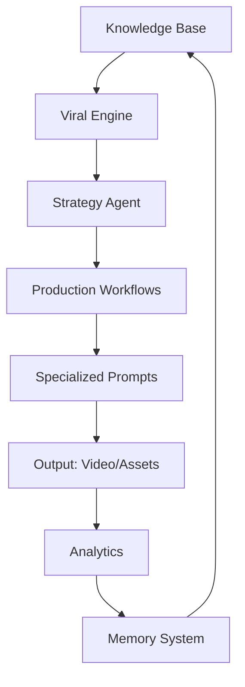

# System Architecture

## Design Philosophy

The AI-YouTube-Kids-Production-OS is built on the principles of **Modularity**, **Consistency**, and **Scalability**. It transition from a simple collection of prompts to a cohesive digital production ecosystem.

## Core Components

### 1. Knowledge Layer (`knowledge/`)
The foundation of the OS. It stores the Brand Bible, Character System, and World Building rules. This layer ensures that every piece of content generated by the AI adheres to the brand's identity and educational philosophy.

### 2. Viral Intelligence Engine (`viral_engine/`)
Responsible for content strategy. It uses viewer psychology, trend analysis, and competitor intelligence to generate high-potential ideas. Each idea is scored based on its "Viral Score," "Educational Value," and "Production Complexity."

### 3. Production Workflows (`workflows/`)
The execution engine. It defines the sequence of operations from ideation to publishing. Each workflow step includes:
- **Inputs/Outputs**: Data requirements for each stage.
- **Agent Assignment**: Which specialized AI agent handles the task.
- **Checklists**: Quality control measures.

### 4. AI Agent Architecture (`prompts/`)
A distributed system of specialized prompts designed for different LLMs (Manus, GPT-4, Claude, etc.).
- **Strategy Agent**: Plans the content calendar.
- **Writer Agent**: Drafts scripts and hooks.
- **Character Agent**: Ensures visual and narrative consistency.
- **Visual Agent**: Generates image and animation prompts.
- **SEO Agent**: Handles metadata and discovery.

### 5. Memory & Analytics (`memory/`, `analytics/`)
The feedback loop. The system tracks performance metrics (CTR, Retention, Watch Time) and stores lessons from both successful and failed content to continuously improve the AI's output.

## Data Flow

1. **Ideation**: Viral Engine generates concepts based on trends and brand knowledge.
2. **Planning**: Strategy Agent validates ideas and creates a content calendar.
3. **Production**: Writer, Character, and Visual Agents execute the workflows.
4. **Optimization**: SEO Agent prepares the content for publishing.
5. **Learning**: Analytics Agent processes results and updates the Memory system.

## Integration Diagram

