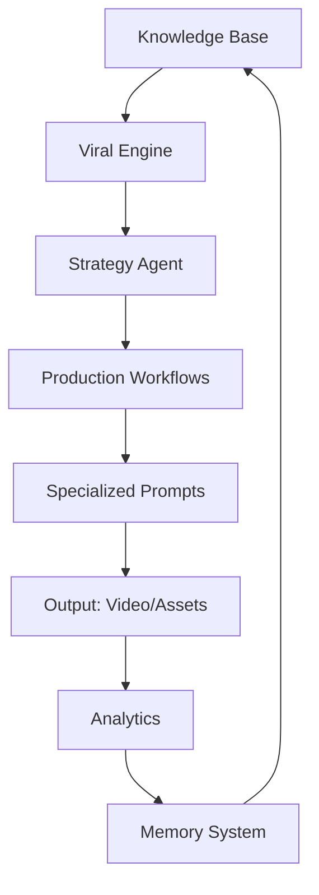

# AI-YouTube-Kids-Production-OS


## Overview

The **AI-YouTube-Kids-Production-OS** is a comprehensive, scalable operating system designed to function as a complete digital production company for YouTube Kids content. Powered by advanced AI agents, this system manages the entire content lifecycle—from viral idea generation to automated publishing and performance analytics.

This repository serves as the **Single Source of Truth (SSOT)** for the brand, ensuring consistency in character development, storytelling style, and production quality across all content.

## Quick Navigation

- [Project Overview](#project-overview)
- [System Architecture](#system-architecture)
- [Main Features](#main-features)
- [Folder Structure](#folder-structure)
- [How the AI Production OS Works](#how-the-ai-production-os-works)
- [How to Add New Characters](#how-to-add-new-characters)
- [How to Create New Stories](#how-to-create-new-stories)
- [How to Add New Prompts](#how-to-add-new-prompts)
- [How Workflows Operate](#how-workflows-operate)
- [How AI Agents Interact with the System](#how-ai-agents-interact-with-the-system)
- [Free API Integrations](#free-api-integrations)
- [Content Creation Methodology](#content-creation-methodology)
- [Future Roadmap](#future-roadmap)
- [License](#license)

## Project Overview

This project aims to transform the traditional content production pipeline into an AI-driven, highly efficient, and scalable system. By centralizing knowledge, automating workflows, and leveraging specialized AI agents, the OS ensures brand consistency and continuous improvement in content quality and viral potential.

## System Architecture

For a detailed breakdown of the system's design philosophy, core components, and data flow, please refer to the [ARCHITECTURE.md](./ARCHITECTURE.md) file.



## Main Features

- **Viral Intelligence Engine**: Data-driven idea generation and trend analysis tailored for the kids' demographic.
- **Comprehensive Knowledge Bibles**: Detailed Character, World, and Story Bibles extracted from proven creative frameworks.
- **Multi-Shot Cinematic Method**: A standardized 5-shot production workflow for consistent visual storytelling.
- **Enhanced Prompt Library**: Specialized libraries for Image, Animation, Voice, and SEO generation.
- **Multi-Agent Architecture**: Specialized AI agents for strategy, writing, visuals, voice, and quality control.
- **Long-Term Memory**: A learning system that improves production based on historical performance data.

## Folder Structure

```text
AI-YouTube-Kids-Production-OS/
├── core/                # Rules, policies, and production standards
├── knowledge/           # Brand bible, character profiles, and world-building
├── viral_engine/        # Idea generation and competitor intelligence
├── workflows/           # Step-by-step production pipelines
├── prompts/             # Specialized AI prompt library
├── assets/              # Character designs, backgrounds, and media references
├── memory/              # Lessons learned and decision logs
├── analytics/           # Performance metrics and automated reporting
├── automation/          # Integration configs (n8n, GitHub Actions, APIs)
└── templates/           # Reusable content and reporting templates
```

## How the AI Production OS Works

The OS operates through a 6-phase content creation methodology, guided by specialized AI agents and supported by a robust knowledge base. From initial trend research to final performance analysis, every step is designed for efficiency, consistency, and continuous learning. Refer to the [Content Creation Methodology](#content-creation-methodology) section for more details.

## How to Add New Characters

To add a new character, create a new Markdown file in the `knowledge/characters/` directory following the `template.md` structure. Ensure all fields are populated, including detailed visual descriptions for AI image generation prompts and unique personality traits. This ensures consistency across all future content featuring the character.

## How to Create New Stories

New stories are initiated through the [Ideation Workflow](./workflows/ideation/process.md). The Strategy Agent generates concepts based on trends and the Brand Bible. Once an idea is approved, the Writer Agent develops a script using the [Episode Script Template](./templates/episode_script_template.md) and the [Story Bible](./knowledge/stories/story_bible.md) to ensure narrative consistency and educational value.

## How to Add New Prompts

New prompts should be added to their respective categories within the `prompts/` directory (e.g., `prompts/image/library.md`, `prompts/voice/voice_prompts.md`). Follow the existing structure and include details on purpose, context, and expected output to ensure AI-friendliness and reusability.

## How Workflows Operate

Workflows define the step-by-step processes for content production. Each workflow specifies inputs, outputs, responsible AI agents, and checklists. The core production flow is detailed in the [End-to-End Production Pipeline](./workflows/production_pipeline.md).

## How AI Agents Interact with the System

AI agents are specialized modules that perform specific tasks within the OS. They interact by reading from knowledge bases (e.g., Character Bible), executing tasks based on prompt libraries, and feeding data into memory and analytics systems. Each agent's configuration and prompt templates are stored in the `prompts/` directory (e.g., [Strategy Agent Configuration](./prompts/strategy/agent_config.md)).

## Free API Integrations

We continuously research and integrate free and open-source APIs to enhance the system's capabilities without incurring significant costs. For a detailed analysis of potential integrations for AI models, voice, image, search, and automation, refer to the [Free API Integration Research](./automation/APIs/free_api_research.md) document.

## Content Creation Methodology

The OS employs a robust 6-phase content creation methodology:

1.  **Research**: Understand market, audience, and educational opportunities.
2.  **Idea Generation**: Develop high-potential content concepts.
3.  **Story Development**: Craft compelling narratives and character arcs.
4.  **Production**: Generate all necessary assets and assemble the video.
5.  **Optimization**: Refine content for maximum reach and quality.
6.  **Learning Loop**: Analyze performance and drive continuous improvement.

For a detailed explanation of each phase, including inputs, outputs, and responsible agents, see the [Content Creation Methodology](./workflows/content_creation_methodology.md) document.

## Future Roadmap

See the [ROADMAP.md](./ROADMAP.md) for planned features and development milestones.

## License

This project is licensed under the MIT License - see the [LICENSE](./LICENSE) file for details.
